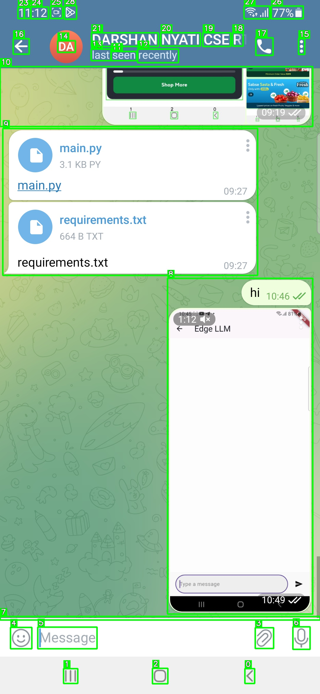
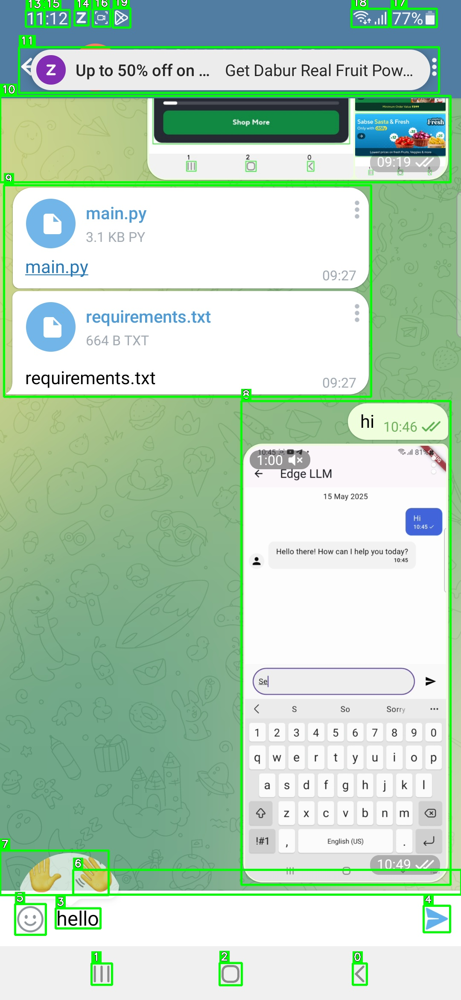
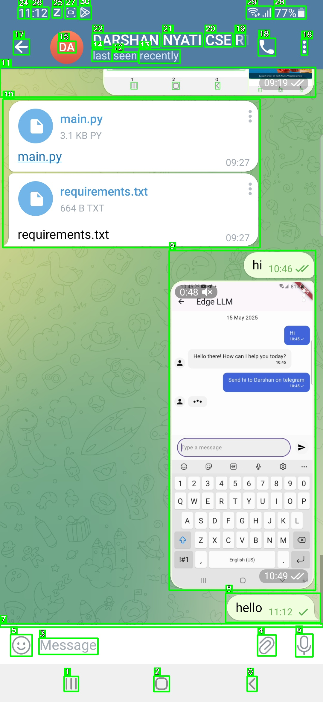

# Mobile-Edge-LLM

A fully autonomous agent that enables **natural language-driven control** of **Android apps**, without accessing their source code or using any SDK. The system converts **user prompts** like “Book a cab” or “Send a message” into actionable UI interactions (tap, scroll, type) by visually analyzing the phone screen in real time.

---

## 🧩 Key Features

- 🧠 **LLM-Powered Intent Understanding** using **Gemini API**
- 📸 **Android Screen Capture** via **ADB + scrcpy**
- 🧮 **UI Element Segmentation** using Meta's **GroundingDINO**
- 🧭 **Touch, Scroll, Input Simulation** to complete tasks
- 📊 **SQLite** database for session and message tracking
- 🧱 **FastAPI WebSocket Backend** with live interaction sessions

---

## 📂 Project Structure

```
📁 root/
 ┣ 📜 main.py              ← Core logic: screen capture, UI segmentation, action execution
 ┣ 📜 models.py            ← SQLModel ORM definitions (ChatSession, Message)
 ┣ 📜 utils.py             ← Database utilities
 ┣ 📜 req.txt              ← Python dependencies
 ┣ 📜 .gitignore
 ┗ 📁 screenshots/         ← Saved screen captures with bounding boxes
```

---

## 🔄 Workflow Overview

### 1. 🧾 Prompt Input
- User inputs a natural language prompt (e.g., "Order food on Zomato").
- Processed by Gemini (via Google Generative AI) to extract **goal**, **actions**, and **target app**.

### 2. 🖼️ Screen Capture
- Android Debug Bridge (ADB) captures current screen.
- Image is preprocessed (grayscale, blur) via OpenCV.

### 3. 🧠 UI Element Segmentation
- GroundingDINO (Zero-shot) detects and classifies UI elements.
- Outputs bounding boxes with semantic meaning (buttons, fields, toggles, etc.).

### 4. 🧷 Token Mapping & LLM Plan
- Each UI element is converted to a **semantic token**.
- LLM uses these tokens to decide next action (e.g., `tap_index`, `input_text`, `swipe_from_center`).

### 5. ✋ UI Interaction Execution
- Commands are executed on the device via ADB:
  - Tap: `input tap x y`
  - Text Input: `input text`
  - Scroll: `swipe`
- Context-aware feedback loop updates based on live screen state.

### 6. 🗂️ Logging
- All sessions and interactions are tracked in a local SQLite database (`chat.db`).

---

## 🧠 Technologies Used

| Component        | Technology                             |
|------------------|----------------------------------------|
| LLM              | Gemini API                             |
| UI Detection     | GroundingDINO (Zero-shot learning)     |
| Computer Vision  | OpenCV                                 |
| Screen Capture   | Android Debug Bridge (ADB)             |
| Automation       | Python subprocess (shell-based)        |
| Backend          | FastAPI (REST & WebSocket)             |
| Database         | SQLite + SQLModel ORM                  |

---

## 💡 Example Prompts

- “Send ‘On my way’ on WhatsApp to Mom”
- “Book a cab to the airport on Ola”
- “Search for dosa in Zomato and place an order”
- “Play Arijit Singh’s playlist on Spotify”

---

## 📸 Sample Output

> Annotated screenshots with UI element bounding boxes are saved after every interaction.





---

## 📅 Future Enhancements

- 🔈 Add voice command input
- 🌐 Offline LLM integration for on-device inference
- 📌 OCR layer for better UI context extraction
- 🧩 Cross-app task chaining

---

